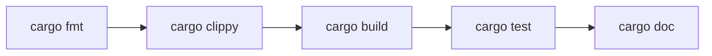
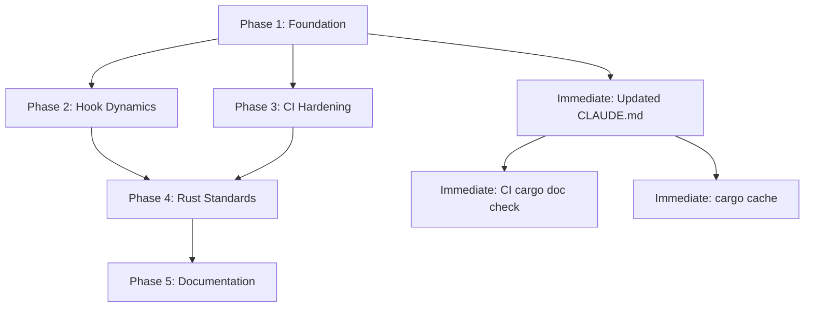

# AI Harness Execution Plan — Heretek-Drop

> **Status**: Design document  
> **Target**: OpenCode + Claude Code AI coding agents  
> **Stack**: Rust (edition 2024) + Slint + Cargo workspace  
> **Date**: 2026-07-30

---

## Table of Contents

1. [Current State Assessment](#1-current-state-assessment)
2. [Pillar 1: Agent Guardrails (Anti-Hallucination & Currency)](#2-pillar-1-agent-guardrails)
3. [Pillar 2: Git Hooks (Husky & Dynamic Hooks)](#3-pillar-2-git-hooks)
4. [Pillar 3: Continuous Integration](#4-pillar-3-continuous-integration)
5. [Pillar 4: Rust Skills & Standards](#5-pillar-4-rust-skills--standards)
6. [Pillar 5: Dynamic & Self-Healing Documentation](#6-pillar-5-dynamic--self-healing-documentation)
7. [Implementation Roadmap](#7-implementation-roadmap)

---

## 1. Current State Assessment

### What We Already Have

| Area                | Good                                                                                                                                 | Needs Improvement                                                                                                                                       |
| ------------------- | ------------------------------------------------------------------------------------------------------------------------------------ | ------------------------------------------------------------------------------------------------------------------------------------------------------- |
| **CLAUDE.md**       | Exists, has "Don't" section, links to AGENTS.md                                                                                      | Too brief (22 lines), no currency-enforcement rules, no verification requirements                                                                       |
| **AGENTS.md**       | Good locked-decisions table, subagent definitions, build commands                                                                    | No anti-hallucination patterns, no verification gate                                                                                                    |
| **Git hooks**       | Husky 9 with pre-commit (fmt→clippy→fallow→prettier), commit-msg (commitlint), pre-push (test)                                       | Hooks are static — run ALL checks on ALL crates every time; no dynamic crate-level targeting; no doc-change detection                                   |
| **CI**              | 5 workflows: ci.yml, release.yml, editorconfig-ci.yml, labeler.yml, osv-scanner.yml; cargo-deny; actionlint; shellcheck; betterleaks | No `cargo doc` check (broken intra-doc links), no `cargo audit` in CI, no nextest, no coverage, no Cargo caching strategy, no `cargo outdated` alerting |
| **Rust standards**  | edition 2024, unsafe_code=deny, clippy correctness/perf=deny, workspace lints, thiserror/anyhow                                      | No unwrap-restriction lint, no `#[must_use]` enforcement on Result-returning functions, no CI-level clippy deny for all lint groups                     |
| **Documentation**   | README.md, CONTRIBUTING.md, TESTING.md exist                                                                                         | No ADR tooling, no `cargo doc` CI check, no doc-sync verification, README architecture diagram is hand-maintained                                       |
| **OpenCode agents** | rust-builder, ui-builder, reviewer; 4 skills (drop-protocol, slint-ui, agpl-compliance, rust-gui-patterns)                           | Skills lack currency/version checks; reviewer agent doesn't verify doc sync; no agent-level knowledge-base for crate versions                           |

### ADR Discrepancies Noted

1. **Husky vs Lefthook**: ADR says "Lefthook (NOT Husky)" but reality uses Husky 9 — we keep Husky, the ADR is stale
2. **Fallow**: ADR says "SKIP v0.1" but pre-commit runs fallow — keep fallow, update ADR
3. **codeql.yml**: Listed in plan but never created — skip (GitHub default setup covers this)
4. **dependabot.yml**: References old Tauri-era path `/apps/desktop/src-tauri` — needs update to `/apps/desktop/`

---

## 2. Pillar 1: Agent Guardrails (Anti-Hallucination & Currency)

### 2.1 CLAUDE.md Design Principles

Research-backed rules for CLAUDE.md:

1. **Keep it under 200 lines** — longer files reduce agent adherence
2. **Explicit "Don't" language** — agents respect negative directives more than positive ones
3. **No conflicting instructions across files** — conflicts cause arbitrary selection
4. **Language-choice guardrails** — encode default language with explicit carve-outs (proven by semgrep/semgrep)
5. **Currency enforcement** — require verification before acting on stale knowledge

### 2.2 Currency Enforcement Rules

Every CLAUDE.md must contain these anti-hallucination directives:

```
## Currency enforcement (MANDATORY — do not skip)

Before proposing architectural changes, new dependencies, or refactors:
1. VERIFY current crate versions on docs.rs or crates.io — do not guess
2. CHECK the Cargo.toml workspace dependencies table — it is the single source of truth
3. CONFIRM the Rust edition (2024) and MSRV (1.85) before suggesting edition-dependent patterns
4. SEARCH `.opencode/skills/` for existing knowledge files before creating new ones
5. NEVER reference Tauri, webview, JavaScript, or Chromium — these are banned
```

### 2.3 Verification Gate

```
## Verification gate

Before committing to any non-trivial change:
- [ ] Did I read the existing code (not guess its content)?
- [ ] Did I check docs.rs for current API shapes for any crate I reference?
- [ ] Did I verify the Rust edition and MSRV still match workspace config?
- [ ] Did I run the pre-commit checks mentally before writing code?
- [ ] Did I check `.opencode/skills/` for existing knowledge files covering this domain?
```

### 2.4 Anti-Pattern Blocklist

Hard-block these agent behaviors in CLAUDE.md:

- "Optimize this" without benchmarks to justify
- "Refactor this" without test coverage to validate
- "Modernize this" without checking what "modern" means for the current Rust edition
- Adding `#[allow(...)]` without a commented justification
- Using `unwrap()` in any code path that touches network, filesystem, or user input
- Adding new dependencies without checking `deny.toml` license allowlist

### 2.5 OpenCode Agent Updates

Each agent definition needs additions:

**rust-builder.md**: Add "Before writing code, verify crate versions on crates.io/docs.rs — don't assume you know the latest API surface."

**reviewer.md**: Add checklist item: "Did the agent verify crate versions against current docs.rs before using their APIs?"

---

## 3. Pillar 2: Git Hooks (Husky & Dynamic Hooks)

### 3.1 Current Hook State

| Hook       | Runs                                     | Issue                                                    |
| ---------- | ---------------------------------------- | -------------------------------------------------------- |
| pre-commit | `cargo fmt → clippy → fallow → prettier` | Full workspace every time — slow for crate-local changes |
| commit-msg | `commitlint`                             | Good                                                     |
| pre-push   | `cargo test --workspace --verbose`       | Full test suite — slow                                   |

### 3.2 Dynamic Crate-Level Hook Design

Replace the static full-workspace pre-commit with a dynamic script that:

1. Detects which crates changed via `git diff --cached --name-only`
2. Maps file paths to workspace members
3. Runs `cargo fmt` and `cargo clippy` only on affected crates
4. Falls back to full workspace if the change spans non-crate files (CI config, root Cargo.toml, etc.)

**Implementation approach** (shell script, no extra dependencies):

```bash
# pre-commit.detect-changes.sh — reusable module
detect_changed_crates() {
    local changed_files
    changed_files=$(git diff --cached --name-only --diff-filter=ACMR)

    local crates=()
    for file in $changed_files; do
        case "$file" in
            apps/desktop/crates/auth/*)       crates+=("-p heretek-drop-auth") ;;
            apps/desktop/crates/database/*)    crates+=("-p heretek-drop-database") ;;
            apps/desktop/crates/protocol/*)    crates+=("-p heretek-drop-protocol") ;;
            apps/desktop/crates/download_manager/*) crates+=("-p heretek-drop-download-manager") ;;
            apps/desktop/crates/process_manager/*)  crates+=("-p heretek-drop-process-manager") ;;
            apps/desktop/crates/shared/*)      crates+=("-p heretek-drop-shared") ;;
            apps/desktop/src/*)                crates+=("-p heretek-drop") ;;
            Cargo.toml | apps/desktop/Cargo.toml) return 1 ;;  # full workspace
        esac
    done

    echo "${crates[@]}" | tr ' ' '\n' | sort -u | tr '\n' ' '
    return 0
}
```

### 3.3 Doc-Change Detection Hook

Add a pre-commit step that:

1. Detects changes to public API in `.rs` files (function signatures with `pub`, new `pub fn`, `pub struct`, `pub enum`, `pub trait`)
2. If public API changed, checks whether doc comments (`///` or `//!`) were also added/changed
3. Warns (but does not block — CI will block) when public API is undocumented

**Detection heuristic** (simplified — doesn't need full AST parsing):

```bash
# Check if any staged .rs file has new public items without docs
git diff --cached -G '^pub (fn|struct|enum|trait|mod|type|const)' -- '*.rs' | \
    grep -B1 '^+pub' | grep -v '^--' | while read line; do
        # Check preceding line is not a doc comment
    done
```

### 3.4 Pre-Push Enhancement

Extend pre-push to:

1. `cargo fmt --all -- --check` (cheap, catch fmt drift)
2. `cargo clippy --workspace --all-targets -- -D warnings` (only on changed crates if possible)
3. `cargo test --workspace` (unchanged — full suite before push is correct)

Add a fast path: if only a single crate changed, run `cargo test -p <crate>` first, then `cargo test --workspace` only if that passes (fast-feedback for crate-local changes).

### 3.5 Hook Implementation Plan

| Step | File                                  | Change                                         |
| ---- | ------------------------------------- | ---------------------------------------------- |
| 1    | `.husky/pre-commit.d/crate-detect.sh` | Create dynamic crate-detection module          |
| 2    | `.husky/pre-commit`                   | Rewrite to call crate-detect + targeted checks |
| 3    | `.husky/pre-commit.d/doc-check.sh`    | Create doc-change warning script               |
| 4    | `.husky/pre-push`                     | Add fmt check + fast single-crate test path    |
| 5    | `package.json`                        | Add `"scripts.doc:check"` hook target          |

---

## 4. Pillar 3: Continuous Integration

### 4.1 Current CI Gaps

| Check            | Status                  | Gap                                       |
| ---------------- | ----------------------- | ----------------------------------------- |
| `cargo fmt`      | ✅ In hooks             | Should also be in CI (redundant but safe) |
| `cargo clippy`   | ✅ —D warnings in hooks | Add `--all-targets --all-features` to CI  |
| `cargo test`     | ✅ In pre-push          | Add nextest for parallel test execution   |
| `cargo deny`     | ✅ In ci.yml            | Add `--all-features`                      |
| `cargo audit`    | ❌ Missing              | Add as separate job                       |
| `cargo doc`      | ❌ Missing              | Catch broken intra-doc links              |
| `cargo outdated` | ❌ Missing              | Weekly report (non-blocking)              |
| Coverage         | ❌ Deferred to v0.2     | Add `cargo tarpaulin` or llvm-cov         |
| Cargo caching    | ❌ Missing              | ~5-10min CI speedup                       |
| Matrix builds    | ❌ Missing              | stable + MSRV verify                      |

### 4.2 CI Workflow Rewrite Plan

#### ci.yml — Enhanced Version

```yaml
# Changes to existing ci.yml:

# 1. Add Rust setup with caching
- uses: dtolnay/rust-toolchain@stable
  with:
    components: clippy, rustfmt
- uses: Swatinem/rust-cache@v2
  with:
    workspaces: "apps/desktop -> target"
    key: ${{ hashFiles('Cargo.lock') }}

# 2. Add explicit fmt check (redundant with hook, safe for CI)
cargo-fmt:
  name: cargo fmt
  runs-on: ubuntu-latest
  steps:
    - uses: actions/checkout@v4
    - uses: dtolnay/rust-toolchain@stable
      with: { components: rustfmt }
    - uses: Swatinem/rust-cache@v2
    - run: cargo fmt --all -- --check

# 3. Add cargo doc check (catches broken intra-doc links)
cargo-doc:
  name: cargo doc
  runs-on: ubuntu-latest
  steps:
    - uses: actions/checkout@v4
    - uses: dtolnay/rust-toolchain@stable
    - uses: Swatinem/rust-cache@v2
    - run: RUSTDOCFLAGS="-D warnings" cargo doc --no-deps --workspace

# 4. Enhance cargo-clippy to deny ALL clippy warnings
# Already: cargo clippy --workspace --all-targets -- -D warnings
# Add: --all-features flag

# 5. Add cargo audit (weekly or on dep change)
cargo-audit:
  name: cargo audit
  runs-on: ubuntu-latest
  steps:
    - uses: actions/checkout@v4
    - uses: dtolnay/rust-toolchain@stable
    - run: cargo install cargo-audit --locked
    - run: cargo audit
```

#### New: cargo-audit.yml

```yaml
name: Cargo Audit
on:
  schedule:
    - cron: "42 6 * * 1" # Monday 6:42 UTC
  push:
    paths: ["**/Cargo.lock"]
jobs:
  audit:
    runs-on: ubuntu-latest
    steps:
      - uses: actions/checkout@v4
      - uses: dtolnay/rust-toolchain@stable
      - run: cargo install cargo-audit --locked
      - run: cargo audit
```

#### CI Caching Strategy

Use `Swatinem/rust-cache@v2` with these parameters:

```yaml
- uses: Swatinem/rust-cache@v2
  with:
    workspaces: "apps/desktop -> target"
    key: ${{ hashFiles('apps/desktop/Cargo.lock') }}
    shared-key: "heretek-drop"
```

This caches:

- `~/.cargo/bin/` — installed tools (cargo-deny, cargo-audit)
- `~/.cargo/registry/` — downloaded crate sources
- `apps/desktop/target/` — compiled artifacts

Key hash invalidation when `Cargo.lock` changes; `restore-keys` fallback to last valid cache.

#### Future: Coverage (v0.2)

```yaml
cargo-coverage:
  name: coverage
  runs-on: ubuntu-latest
  steps:
    - uses: actions/checkout@v4
    - uses: dtolnay/rust-toolchain@stable
      with: { components: llvm-tools-preview }
    - run: cargo install cargo-llvm-cov
    - run: cargo llvm-cov --workspace --lcov --output-path lcov.info
    - uses: codecov/codecov-action@v5
```

### 4.3 deny.toml Enhancements

Current `deny.toml` needs:

```toml
# Add [bans] section to block problematic crates
[bans]
deny = [
    # Prevent accidental openssl usage (use rustls)
    { name = "openssl" },
    { name = "openssl-sys" },
    { name = "openssl-probe" },
]

# Enhance [advisories]
[advisories]
# ... existing ...
ignore = [
    # Add dates so we know when to review
    # paste (transitive via Slint) — review at v0.2
    { id = "RUSTSEC-2024-0436", reason = "Transitive via Slint, no direct usage, review at v0.2 stable cut", until = "2026-12-31" },
]
```

### 4.4 CI Workflow Summary

| Job                | Priority | Complexity | Current        | Target                        |
| ------------------ | -------- | ---------- | -------------- | ----------------------------- |
| cargo fmt          | Medium   | Low        | In hooks only  | Move to CI                    |
| cargo clippy       | High     | Low        | ✅ Good        | Add `--all-features`          |
| cargo test         | High     | Low        | ✅ In pre-push | Add nextest                   |
| cargo doc          | High     | Low        | ❌ Missing     | **NEW** — catch broken links  |
| cargo deny         | Medium   | Low        | ✅ Good        | Add `[bans]` section          |
| cargo audit        | Medium   | Medium     | ❌ Missing     | **NEW** — weekly schedule     |
| Cargo caching      | Medium   | Low        | ❌ Missing     | **NEW** — Swatinem/rust-cache |
| Coverage           | Low      | Medium     | ❌ Deferred    | v0.2 target                   |
| Matrix stable+MSRV | Low      | Low        | ❌ Missing     | Defer to v0.2                 |

---

## 5. Pillar 4: Rust Skills & Standards

### 5.1 Mandatory Tooling Chain

Every agent MUST use this tooling chain in order:



| Tool           | Command                                                                | Enforcement         |
| -------------- | ---------------------------------------------------------------------- | ------------------- |
| `cargo fmt`    | `cargo fmt --all -- --check`                                           | Pre-commit + CI     |
| `cargo clippy` | `cargo clippy --workspace --all-targets --all-features -- -D warnings` | Pre-commit + CI     |
| `cargo build`  | `cargo build --workspace`                                              | Pre-push (via test) |
| `cargo test`   | `cargo test --workspace`                                               | Pre-push + CI       |
| `cargo doc`    | `RUSTDOCFLAGS="-D warnings" cargo doc --no-deps --workspace`           | CI                  |
| `cargo deny`   | `cargo deny check`                                                     | CI                  |
| `cargo audit`  | `cargo audit`                                                          | CI (weekly)         |

### 5.2 Workspace Lint Configuration (Current + Proposed)

**Current** (`Cargo.toml`):

```toml
[workspace.lints]
clippy.all = { level = "warn", priority = -1 }
clippy.correctness = { level = "deny" }
clippy.perf = { level = "deny" }
clippy.style = { level = "warn", priority = -1 }
rustdoc.missing_docs = "warn"
rust.unused_must_use = "deny"
rust.unsafe_code = "deny"
```

**Proposed additions**:

```toml
[workspace.lints]
# Existing + add:
clippy.unwrap_used = "deny"          # Ban unwrap() entirely in library crates
clippy.expect_used = "deny"          # Ban expect() entirely in library crates
clippy.panicking_unwrap = "deny"     # Catch known-safe unwraps that still panic
clippy.missing_panics_doc = "warn"   # Require docs on functions that can panic
clippy.must_use_candidate = "warn"   # Suggest #[must_use] on Result-returning fns
rust.missing_docs = "warn"           # Warn on missing docs for pub items
clippy.doc_markdown = "warn"         # Catch missing backticks in docs
clippy.wildcard_imports = "deny"     # Ban `use foo::*` in library crates
clippy.cast_lossless = "warn"        # Warn on lossless casts that could be safer
clippy.redundant_closure = "warn"    # Catch unnecessary closures
clippy.single_match_else = "warn"    # Prefer if-let over match with single arm + else
```

**Crate-level overrides** (in `apps/desktop/Cargo.toml`):

```toml
[lints.workspace]
# inherit = true — all workspace lints apply

# Binary crate: allow unwrap in main() setup
[lints.clippy]
unwrap_used = { level = "allow", priority = 1 }
```

### 5.3 Error Handling Standards

| Pattern             | Required                                   | Forbidden                              |
| ------------------- | ------------------------------------------ | -------------------------------------- |
| Library errors      | `thiserror` derive enum                    | Naked strings, `anyhow` in library API |
| App glue errors     | `anyhow::Result` / `anyhow!`               | `unwrap()`, `expect()`                 |
| Propagating errors  | `?` operator                               | `.unwrap()`, `.expect()`               |
| Channels            | `tx.send()?` or `let _ = tx.send(...)`     | `tx.send(...).unwrap()`                |
| I/O errors          | `std::io::Result` with `thiserror` wrapper | Direct `unwrap()`                      |
| Config parse errors | `toml::de::from_str` → `anyhow!` context   | `unwrap()` on parse result             |

**Replacement table**:

```rust
// ❌ DON'T
let x = some_result.unwrap();
let y = optional.unwrap();
let z = result.expect("message");

// ✅ DO
let x = some_result?;
let x = some_result.context("meaningful context")?;
let y = optional.ok_or(MyError::MissingValue)?;
let y = optional.context("explain why None is impossible here")?;
```

### 5.4 Borrowing & Ownership Standards

- Prefer `&str` over `&String` in function parameters
- Prefer `&[T]` over `&Vec<T>` in function parameters
- Use `Cow<'_, str>` when you need owned or borrowed in return
- Minimize `clone()` — prefer `Arc` for shared ownership
- Use `Rc<RefCell<T>>` only in Slint callback closures (single-threaded UI context)
- Avoid `unsafe` entirely (workspace lint denies it; if truly necessary, wrap in safe API with SAFETY comment)

### 5.5 Async Standards

- Tokio multi-thread runtime (`#[tokio::main]`)
- Bounded channels everywhere: `flume::bounded(N)` or `tokio::sync::mpsc::channel(N)` with N documented
- No blocking I/O in async context — use `tokio::task::spawn_blocking`
- Slint UI updates via `slint::invoke_from_event_loop` or `slint::spawn_local`
- Prefer `reqwest` with rustls-tls (not openssl) — already configured

### 5.6 Rust 2024 Edition Compliance Checklist

- [ ] All `extern "C" {}` blocks use `unsafe extern "C" {}` syntax
- [ ] `#[export_name]`, `#[link_section]`, `#[no_mangle]` wrapped in `#[unsafe(...)]`
- [ ] Unsafe operations inside `unsafe fn` wrapped in explicit `unsafe {}` blocks
- [ ] `cargo fix --edition` run to auto-migrate extern blocks
- [ ] Manual FFI signature review after migration (cargo fix can't verify correctness)

---

## 6. Pillar 5: Dynamic & Self-Healing Documentation

### 6.1 Architecture Decision Records (ADR)

**Tool**: [npryce/adr-tools](https://github.com/npryce/adr-tools) — CLI-based, 4k lines of Bash, no dependencies

**Directory**: `docs/adr/` (new)

**Process**:

```bash
# Initialize ADR directory
cd docs && adr-init

# Record a decision
adr-new "Use Husky 9 instead of Lefthook for git hooks"

# Supercede a previous decision
adr-new -s 1 "Replace Lefthook with Husky 9"
```

**ADR index**: `docs/adr/README.md` (auto-generated by adr-tools)

**ADR template**:

```markdown
# ADR-NNN: Title

## Status

[Proposed | Accepted | Deprecated | Superseded by ADR-NNN]

## Context

What is the issue that motivates this decision?

## Decision

What is the change being made?

## Consequences

Why is this the right decision? What trade-offs exist?

## Compliance

How will CI/hooks enforce this decision?
```

**Initial ADRs to create**:

| #   | Title                                            | Status                                 |
| --- | ------------------------------------------------ | -------------------------------------- |
| 001 | Use Husky 9 for Git Hooks                        | Accepted (overrides Lefthook decision) |
| 002 | CI Must Check `cargo doc` for Broken Links       | Accepted                               |
| 003 | CLIENT.md Must Be <200 Lines with Currency Rules | Accepted                               |

### 6.2 CI Documentation Integrity Checks

**Check 1: `cargo doc` with deny warnings** (in ci.yml)

```yaml
- name: Check doc integrity
  run: RUSTDOCFLAGS="-D warnings" cargo doc --no-deps --workspace
```

This catches:

- `broken_intra_doc_links` — links to symbols that don't exist
- `missing_docs` — public items without doc comments
- `invalid_codeblock_attributes` — broken markdown in docs

**Check 2: README architecture diagram sync** (future, v0.2)

A script that validates:

- All crates listed in README architecture table exist in workspace
- No crate in workspace is missing from README
- Exit with warning if mismatch found

```bash
# docs/check-crate-table.sh
# Extracts crate table from README.md, compares to workspace members
```

**Check 3: API change → doc change correlation** (future, v0.2)

A more sophisticated check that:

- Diffs `apps/desktop/src/lib.rs` re-exports
- If public API surface changed, requires corresponding doc updates

### 6.3 README Maintenance

**Automated README update for dependency table**:

The crate dependency table in README.md is currently hand-maintained. Replace with a script that:

```bash
# docs/generate-crate-table.sh
# Parse workspace Cargo.toml + member Cargo.toml files
# Output markdown table
```

This script is run as part of `pre-push` or documented as `pnpm docs:sync`.

### 6.4 Doc-Test Enforcement

`cargo test` implicitly runs doc-tests (`/// ```rust` blocks). To ensure doc-test coverage:

```toml
# In Cargo.toml workspace lints:
[workspace.lints]
clippy.doc_markdown = "warn"         # Catch missing backticks
rustdoc.missing_crate_level_docs = "warn"  # Require crate-level docs
```

Future enhancement (v0.2): Add `cargo test --doc` as a separate CI step to make doc-test failures visible independently.

### 6.5 Knowledge Base Maintenance

The `.opencode/skills/` directory forms an agent-accessible knowledge base:

| Skill                        | Purpose                       | Update trigger             |
| ---------------------------- | ----------------------------- | -------------------------- |
| `drop-protocol/SKILL.md`     | REST API shapes, JWT flow     | API contract changes       |
| `slint-ui/SKILL.md`          | Slint markup, patterns        | New Slint version release  |
| `agpl-compliance/SKILL.md`   | License rules, static linking | License dependency changes |
| `rust-gui-patterns/SKILL.md` | Tokio↔Slint bridging         | New async patterns         |

**Add a version-refresh note to each SKILL.md**:

```markdown
> **Currency**: This skill was last verified against Slint 1.13.
> Before using, verify current Slint version in workspace Cargo.toml.
> If versions mismatch, update this file or consult docs.rs for breaking changes.
```

---

## 7. Implementation Roadmap

### Phase 1: Foundation (This Session)

| Step | What                                             | Files                      |
| ---- | ------------------------------------------------ | -------------------------- |
| 1.1  | Write updated CLAUDE.md with currency guardrails | `CLAUDE.md`                |
| 1.2  | Write this design document                       | `AI_HARNESS_PLAN.md`       |
| 1.3  | Add cargo doc CI check                           | `.github/workflows/ci.yml` |
| 1.4  | Add Swatinem/rust-cache to CI jobs               | `.github/workflows/ci.yml` |
| 1.5  | Enhance deny.toml with [bans] section            | `deny.toml`                |
| 1.6  | Initialize ADR directory + first ADRs            | `docs/adr/`                |

### Phase 2: Hook Dynamics (Next Session)

| Step | What                                           | Files                                 |
| ---- | ---------------------------------------------- | ------------------------------------- |
| 2.1  | Create crate-detect.sh module                  | `.husky/pre-commit.d/crate-detect.sh` |
| 2.2  | Rewrite pre-commit for dynamic crate targeting | `.husky/pre-commit`                   |
| 2.3  | Add doc-change warning to pre-commit           | `.husky/pre-commit.d/doc-check.sh`    |
| 2.4  | Enhance pre-push with fmt check + fast path    | `.husky/pre-push`                     |
| 2.5  | Update package.json with doc-check script      | `package.json`                        |

### Phase 3: CI Hardening (Next Session)

| Step | What                                             | Files                               |
| ---- | ------------------------------------------------ | ----------------------------------- |
| 3.1  | Create cargo-audit.yml workflow                  | `.github/workflows/cargo-audit.yml` |
| 3.2  | Create cargo-doc.yml workflow (or add to ci.yml) | `.github/workflows/ci.yml`          |
| 3.3  | Add nextest integration                          | `.config/nextest.toml` + ci.yml     |
| 3.4  | Fix dependabot.yml stale Tauri paths             | `.github/dependabot.yml`            |
| 3.5  | Fix CODEOWNERS stale Tauri paths                 | `.github/CODEOWNERS`                |
| 3.6  | Add `--all-features` to clippy CI job            | `.github/workflows/ci.yml`          |

### Phase 4: Rust Standards Hardening (Next + Future)

| Step | What                                         | Files                              |
| ---- | -------------------------------------------- | ---------------------------------- |
| 4.1  | Add workspace lint enhancements              | `Cargo.toml`                       |
| 4.2  | Audit existing codebase for unwrap usage     | All `.rs` files                    |
| 4.3  | Review Rust 2024 edition compliance          | All `.rs` files with extern blocks |
| 4.4  | Update agent definitions with currency rules | `.opencode/agents/*.md`            |
| 4.5  | Add version-refresh notes to all skills      | `.opencode/skills/*/SKILL.md`      |

### Phase 5: Documentation Self-Healing (Future)

| Step | What                                 | Files                          |
| ---- | ------------------------------------ | ------------------------------ |
| 5.1  | Create docs/generate-crate-table.sh  | `docs/generate-crate-table.sh` |
| 5.2  | Update stale ADR (Husky vs Lefthook) | `docs/adr/`                    |
| 5.3  | Add pnpm docs:sync script            | `package.json`                 |
| 5.4  | Add README sync check to CI (v0.2)   | `.github/workflows/ci.yml`     |
| 5.5  | Add doc-test CI enforcement          | `.github/workflows/ci.yml`     |

### Dependency Graph



---

## Appendices

### A. CI Workflow Reference — Key Changes

**ci.yml additions**:

```yaml
# Add to existing ci.yml or as new jobs:

cargo-fmt:
  name: cargo fmt
  runs-on: ubuntu-latest
  steps:
    - uses: actions/checkout@v4
    - uses: dtolnay/rust-toolchain@stable
      with: { components: rustfmt }
    - uses: Swatinem/rust-cache@v2
      with:
        workspaces: "apps/desktop -> target"
    - run: cargo fmt --all -- --check

cargo-doc:
  name: cargo doc
  runs-on: ubuntu-latest
  steps:
    - uses: actions/checkout@v4
    - uses: dtolnay/rust-toolchain@stable
      with: { components: rust-docs }
    - uses: Swatinem/rust-cache@v2
      with:
        workspaces: "apps/desktop -> target"
    - run: RUSTDOCFLAGS="-D warnings" cargo doc --no-deps --workspace

cargo-audit:
  name: cargo audit
  runs-on: ubuntu-latest
  steps:
    - uses: actions/checkout@v4
    - uses: dtolnay/rust-toolchain@stable
    - run: cargo install cargo-audit --locked
    - run: cargo audit
```

### B. Key Research Findings Referenced

These findings were adversarially verified through the deep-research workflow:

1. **CLAUDE.md under 200 lines** increases adherence; conflicting instructions across files cause arbitrary agent selection [Source: Claude Code docs]
2. **Language-choice guardrails** proven by semgrep/semgrep AGENTS.md pattern: default language with explicit carve-outs, ban fallback to easier languages [Source: semgrep/semgrep]
3. **`broken_intra_doc_links` is rustdoc-only** — `cargo check` silently misses broken doc links; only `cargo doc` catches them [Source: rustdoc lints docs]
4. **`[workspace.dependencies]` additive feature resolution** — member-level features combine with workspace-level (no replacement) [Source: Cargo Book]
5. **Rust 2024 mandatory unsafe markers** — `extern "C" {}` → `unsafe extern "C" {}`; `cargo fix --edition` handles mechanical migration but cannot verify FFI correctness [Source: Rust Edition Guide]
6. **cargo-deny supports crate bans** — `[bans]` section can block specific crates (e.g. openssl) [Source: cargo-deny docs]
7. **ADR management with CLI tools** — npryce/adr-tools (~4k lines Bash) creates sequential Markdown files, supports superseding [Source: adr-tools README]

### C. Open Questions (Deferred)

1. **nextest adoption**: Should we adopt nextest in v0.1 or wait for v0.2? Benefits: parallel test execution, per-test timeouts, better failure output. Cost: new CI dependency. Decision: defer to v0.2 (current test suite is small enough).
2. **SCCACHE vs Swatinem/rust-cache**: For a project with <30 Rust files, Swatinem/rust-cache is sufficient. SCCACHE adds complexity without proportional benefit. Decision: use Swatinem/rust-cache.
3. **Clippy `unwrap_used` denial in binary crate**: The `heretek-drop` binary crate should allow `unwrap()` in `main()` entry point and test code. Crate-level overrides solve this cleanly.

---

_End of AI Harness Execution Plan_
